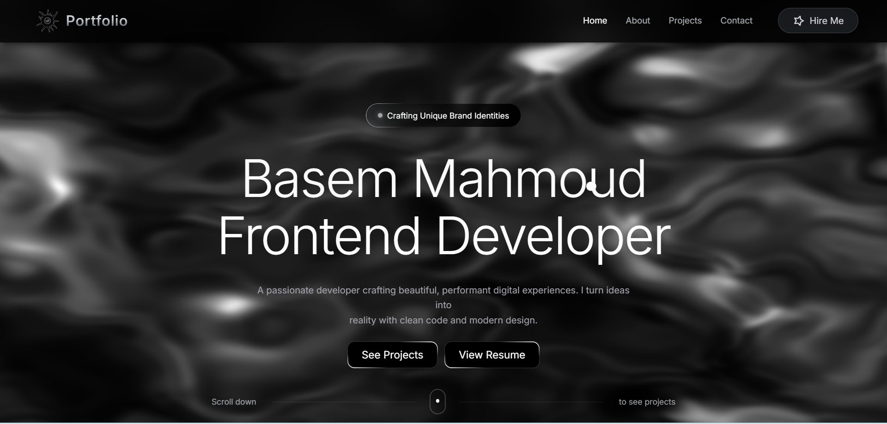

## 📸 Preview

# 🚀 My Portfolio

Welcome to my personal portfolio website!  
This project showcases my skills, projects, and experience as a web developer.

---

## 🌐 Live Demo
👉 [https://my-portfolio-dquashc5l-basem6s-projects.vercel.app//)

---

---
## 🛠️ Built With

- React.js ⚛️
- Tailwind CSS 🎨
- JavaScript (ES6+)
- GSAP Animations ✨ (if you used it)
- React Router DOM
- Vite / Next.js (choose one)

---

## ✨ Features

- Fully responsive design 📱💻
- Smooth animations and transitions
- Projects showcase section
- About me section
- Contact form (email integration)
- Modern UI/UX design

---

If you want, I can also:
- make it **more advanced (with badges + animations section + GSAP mention)**
- or write a **super fancy README like top dev portfolios on GitHub**
- or tailor it exactly to your project (send me your stack 👍)
